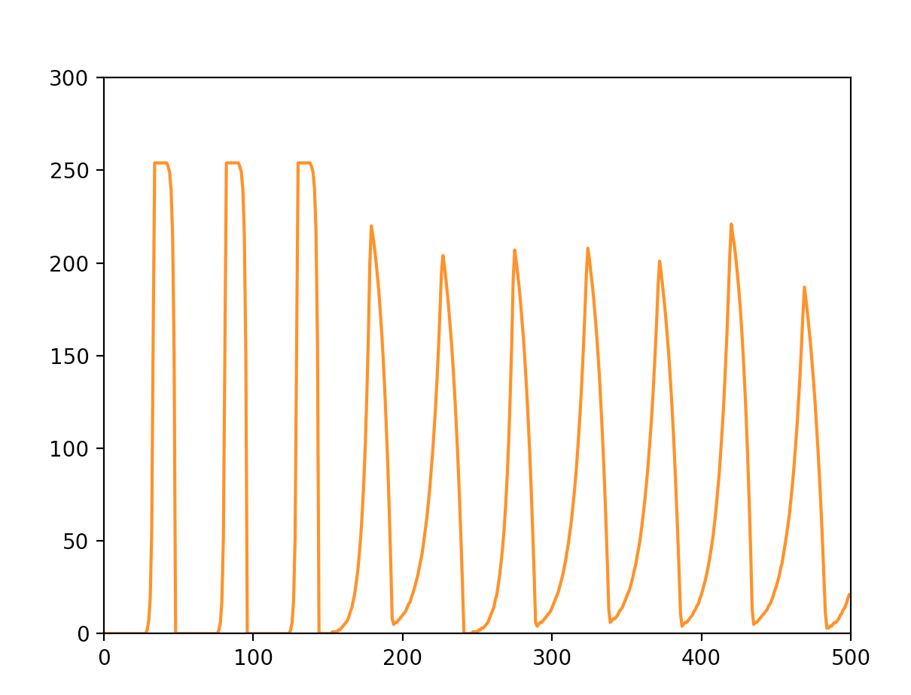
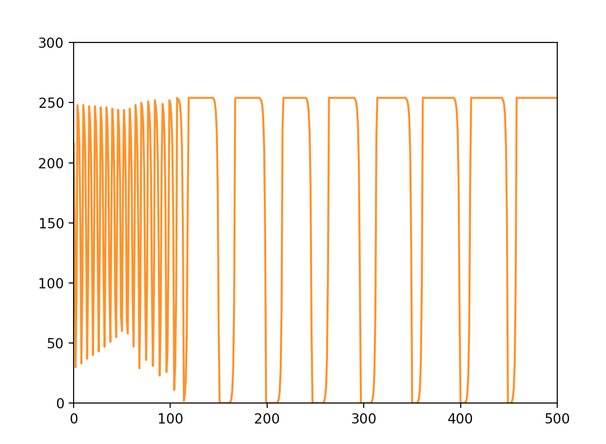
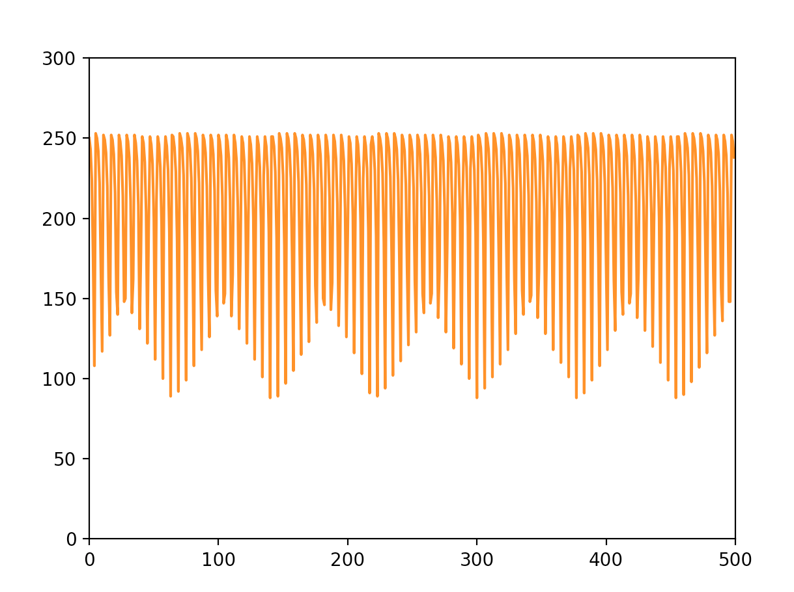
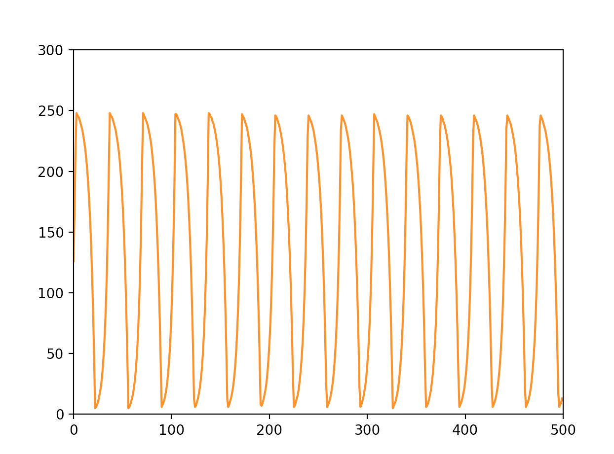

# MegaBlinkOptoTremolo
An Arduino based optotremolo guitar effect

The Tremolo guitar effect modulates the volume of an audio signal. It is one of the oldest guitar effects and was included in many early guitar amplifiers. A good example of tremolo is Johnny Marr's use of the built in Fender Twin tremolo for the rhythm guitar of the song [How Soon Is Now?](https://www.youtube.com/watch?v=hnpILIIo9ek) by The Smiths. It creates a watery wavering sound that works great with amplified instruments.

The earliest tremolo circuits utilised a modulating light source and a Light Dependent Resistor (LDR) to modulate the amplitude of the audio signal. The MegaBlinkOptoTremolo used an Arduino to modulate the light source, a LED, and a LDR that controls the amplitude of the audio signal. A JFET booster circuit is used to counteract the drop in volume incurred when using LDRs.

The MegaBlinkOptoTremolo is named after the Arduino Blink example file. It uses (atleast) 3 pots. It provides methods to increase the speed of the blinking LED via one pot. Another pot allows the user to manipulate the 'shape' of the LED waveform. The shape pot changes the steepness of the ramp between the 'crest' and 'trough' of the waveform. This allows for hard 'clipping' tremolo and softer 'pulsing' sounds. I did plan to add a saw wave -> triangle -> reverse saw-wave setting but I opted to add a PWM-style duty cycle. It might be interesting to run a second LED channel for stereo tremelo effects. The intensity of the effect can be modified via an 10K pot in series with the LED.

I think this is just an interference pattern with the sampling rate, not an actual waveform.

